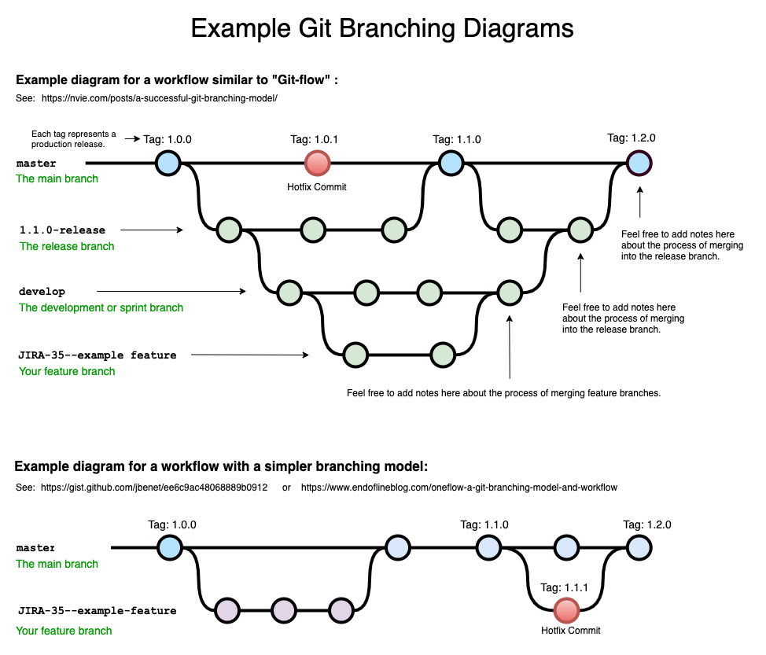
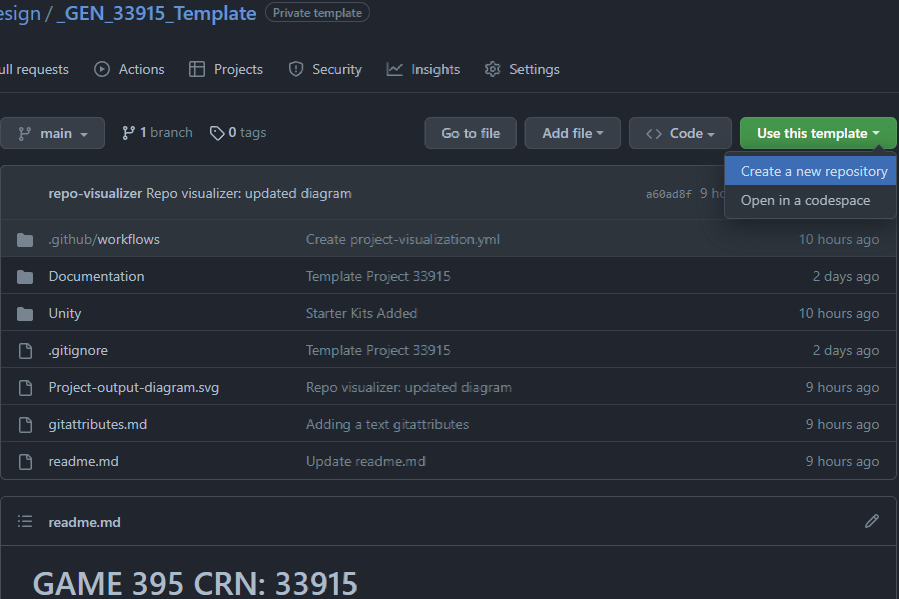
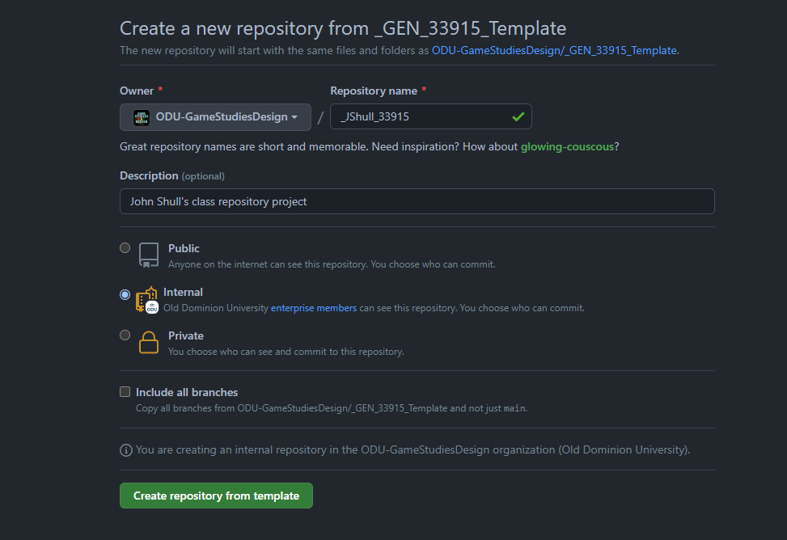
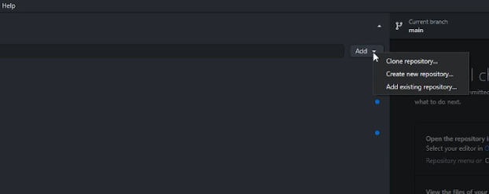
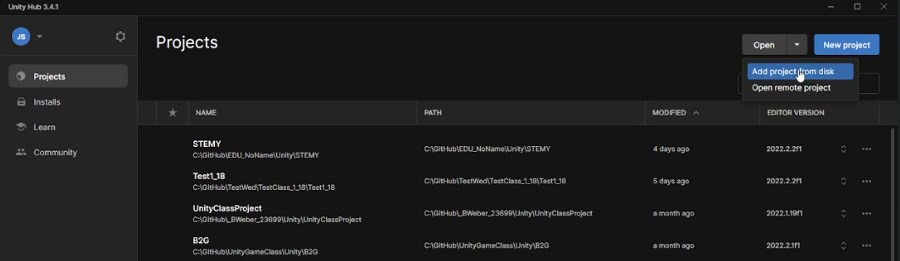
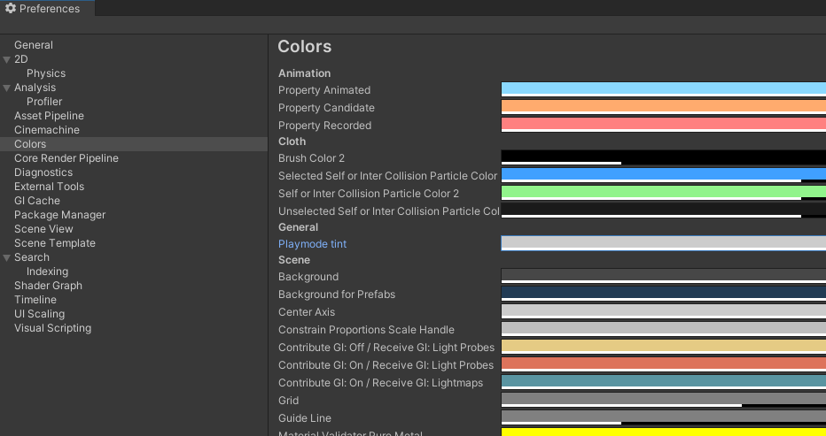

# Week Agenda

## GitHub Organization and Templates

* House keeping: GitHub Accounts Not Setup - without this account you will get an incomplete
  * Jaden Bridges
  * Elon Womble
  * Eli Sanderson
* Clone Repository vs Forking a Repository
* [Template Repository](https://docs.github.com/en/repositories/creating-and-managing-repositories/creating-a-template-repository)
  * Creating a [Repository from a Template](https://docs.github.com/en/repositories/creating-and-managing-repositories/creating-a-repository-from-a-template)
* [Git Submodules](https://github.blog/2016-02-01-working-with-submodules/)
  * This can be incredibly powerful and allow you to break up your work!
* Working across multiple branches - [GitHub Flow Model](https://docs.github.com/en/get-started/quickstart/github-flow)
  * 

## Software Registries / Package Managers

* This is also very similar to a common practice in Software Development: PACKAGES!
* [NPM](https://www.npmjs.com/)? Worlds Largest Software Registry
* [NuGet](https://www.nuget.org/): Windows/Microsoft .NET
* [Chocolatey](https://chocolatey.org)

## Unity Project Setup with GitHub Templates

* Primary way for the first few weeks I will help mitigate content to you for this class - this means every class expect some sort of 10-15 minute initial hiccup on getting this pulled down - going to try and consolidate the work in one unity project for the class as we go through things while the other project folder is for your main semester project
* Let's get you all setup!
* [Organization Template-33915](https://github.com/ODU-GameStudiesDesign/_GEN_33915_Template)
  * If you don't see the link and/or you get an error: make sure to login to GitHub!
  * 'Use this template' --> 'Create a new repository'
  
  * Make sure to keep the owner as 'ODU-GameStudiesDesign' and for the repository name this is very important!
    * "_" + <first letter of first name> + <entire LastName>+ "_33915"
      * **FOR EXAMPLE** for me: John Shull = "_JShull_33915"
    * 
* GitHub Desktop
  * This repository that you just created is only online - need to get it on the local machine you're working with - open up GitHub desktop and lets add it
  * 
* Unity Hub
  * 
  * The version was created in Unity 2022.2.2f1--> if you have that option go with that version, if not go with a recent 2022.2.x version that you do have and go through the steps of letting Unity Hub convert it for you.

## Unity Editor

* We are going to now play around with the 1st and 3rd person starter kits by Unity
* [Unity Hot Key Shortcuts](../docs/Unity_shortcuts.pdf) this PDF was created by Oxmond Technology and the original can be found at their site [here](https://oxmond.com/unity-shortcuts/)
* You can also make/edit your own: Windows: Edit-->ShortCuts on Windows, Mac: Unity-->ShortCuts
//End of Monday class
* Unity Editor Adjustments: Colors and Windows!
  * Why? Don't want to forget you're in play mode!
  * 
* Modifying GameObjects and Editor secret tricks - Select all GameObjects and distribute evenly or randomly!
  * L(0,4)
  * R(0,5)
//Wednesday Class added items
* Unity Prefabs
* Unity Package Manager
  * Preview packages
* Unity Recorder

### Unity Packages

The Unity Package is a fantastic approach to how Unity manages content and libraries - just like how we discussed about NuGet and NPM - Unity has a built in package manager that not only can you hijack - but make your own content/packages for!

* [The Package Manager](https://docs.unity3d.com/Manual/upm-ui.html)
* [Custom GitURL Packages](https://docs.unity3d.com/Manual/upm-ui-giturl.html)
* [Unity Packages](https://docs.unity3d.com/Manual/PackagesList.html)
* [Enable Preview Packages](https://docs.unity3d.com/Manual/class-PackageManager.html)
* In Class [Recorder Package Installer](https://docs.unity3d.com/Packages/com.unity.recorder@4.0/manual/index.html)
