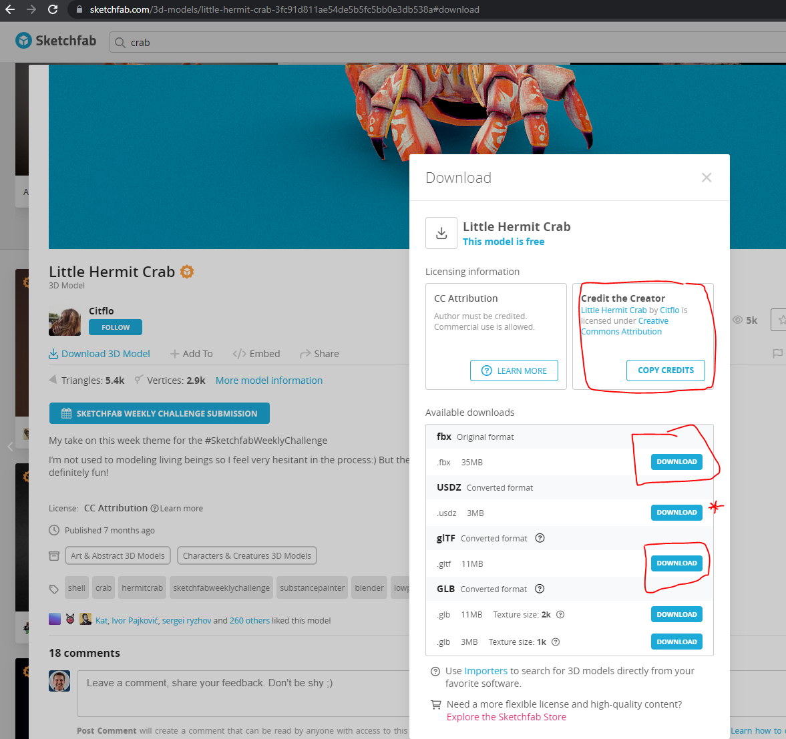
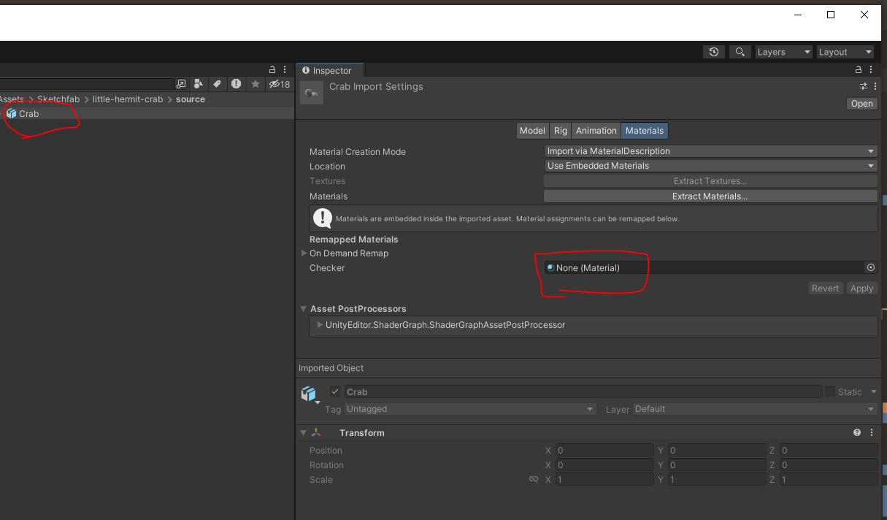
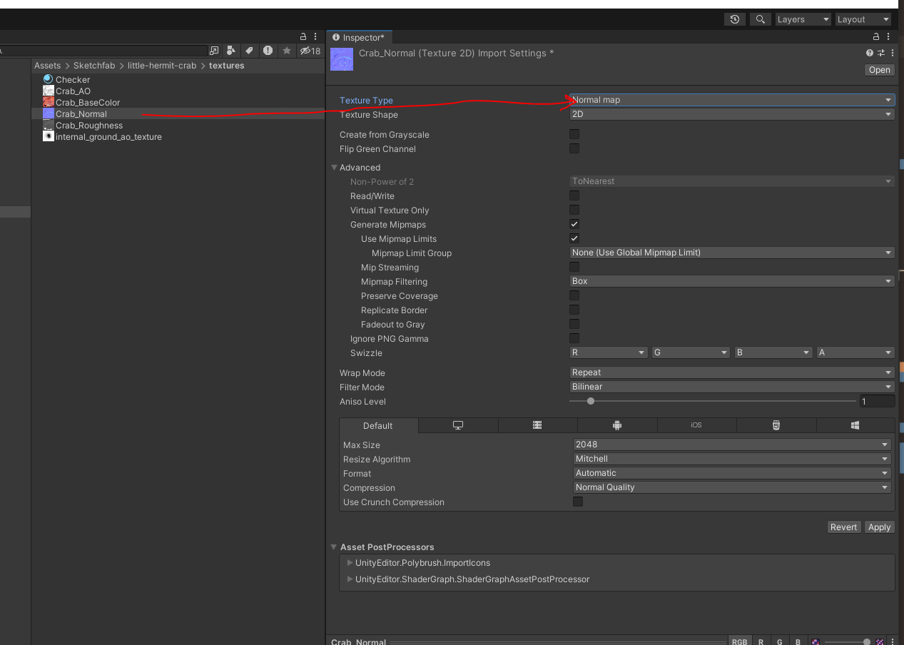
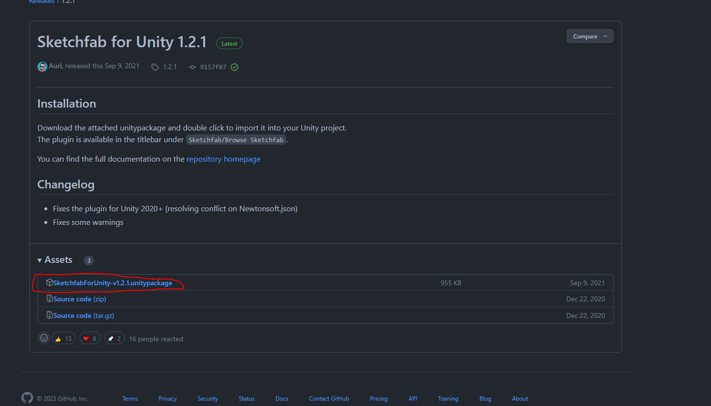

# Unity Importing Assets

## Standards

In all cases with Unity you need to work around standards associated with your media/content that you are bringing in. [Unity's 3D model file formats](https://docs.unity3d.com/2020.1/Documentation/Manual/3D-formats.html).

### 3D Assets

* Popular Standards:
  * FBX
  * GLTF
* Materials and Textures
  * You have some options here on how much you want to unpack vs not unpack
* Importing Rigs is different and we will cover that a little more in detail in the later weeks.
  * Importing animation clips will also be part of this process

### 2D Assets

* Popular Standards:
  * JPEG/JPG
  * PNG
* Multiple ways to render these items
  * In World?
  * In UI- think 'sprite'
  * On another material - think 'texture'

### Manually Importing Random Items

* Let's go download some random 3D items and just throw them in Unity
* [SketchFab Crab](https://sketchfab.com/3d-models/little-hermit-crab-3fc91d811ae54de5b5fc5bb0e3db538a)
  * Model Contributions: ["Little Hermit Crab"](https://skfb.ly/ovA9E) by Citflo is licensed under [Creative Commons Attribution](http://creativecommons.org/licenses/by/4.0/).
  
* Now that it's downloaded let's throw it in our Unity Project
  * Notice the format... *.zip!
  * Unpack it and make sure to unpack it in a folder that makes sense either inside Unity directly or externally then you can drag/copy it over
  * 
  * 

### Sketchfab Linked Importing/Exporting

* [SketchFab updated Unity Plugin](https://github.com/sketchfab/unity-plugin/releases/tag/1.2.1)
  * Download the Unity Package Example
* 
  