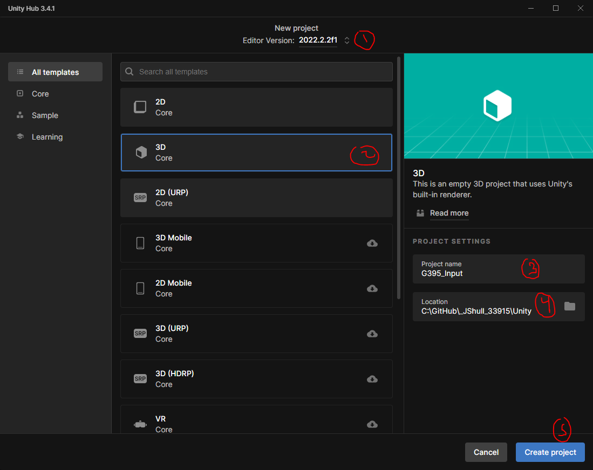
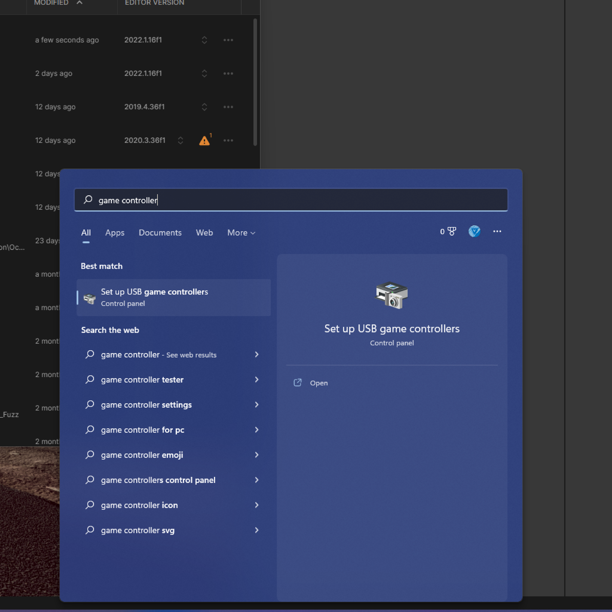
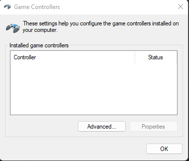

# Unity Input System

This repository is based on the [Unity Learn content tied to the Input System](https://learn.unity.com/project/using-the-input-system-in-unity).

[Unity Example on itch.io](https://unity-learn.itch.io/experience-unity)

## General Setup Notes

We are going to be creating a new Unity Project in your current _Student_36619 repository under your Unity folder. We are going to do this through the Unity Hub - but lets make sure we *know* exactly where we want to create it!

- Folder location
  - 
- Unity Hub New Project
  - 
  - 
- Unity will take a few minutes to generate this project lets move on to showcase how we can identify a plugged in USB Controller

## Input Example Project

This section will go through explaining pieces of the Unity Input System. For an ultimate guide please go through the Unity Learn pathway suggested above. This document will be broken up into sections in order. You do not need to have a controller to continue.

### Controller Setup

If you're using an XBox Controller on Windows PC - make sure that your PC recognizes the controller. The simple way to do this. Plug in your controller, wait a few seconds, go to the Windows Start Button/Search area and type in 'Game Controller' you should see a Windows software suggestion pop-up as in the image below. Select it.

- 
- 

If Windows doesn't see any controllers it will look like this: sometimes it takes a few seconds to register.

You should see this:

- 
- 

Hopefully now Unity has opened up!

## Unity

### Input System Package Manager & Device Setup

- Bring in the Input System Package: currently using 1.4.4
  - 
  - 
  - Before we restart, hit **No** and lets install some samples
    - 
    - 
  - Go to the top toolbar: 'Edit-->Project Settings' and look in the Other panel for Active Input Handling and make sure it says 'Both'
    - 
  - Unity has to restart the editor to enable the new input system
    - You might see some errors when you restart, this could be related to how we have our input options setup and/or existing Unity sample content
- Back to Project Settings 'Edit-->Project Settings' look for the **Input System Package** option in the left panel
  - Click 'Create Settings Asset'
  - 
  - 
- In some cases Unity's Editor might throw a lot of errors and you might need to restart after making this.
- In some cases you also have to force Unity to restrict/Scope down it's choices of input devices to **ONLY** look for these said 'Supported Devices'
  - You can do this by going to the Input System Package in the Project settings and updating the Supported Devices category:
  - 
- Open up the Unity Sample Scene:
  - Project Tab: "./Assets/Samples/Input System/1.4.4/UI vs. Game Input" --> UIvsGameInput.unity
  - Explore how left/right mouse work and how you can also click on UI items without it getting interrupted

### Unity Learn Assets

- I updated and fixed some Unity Learn assets - they are in the Weekly Repository and can be downloaded directly from the [G395_WeeklyFiles/Week4](InputSystemAssets_2022Fix.unitypackage) project.
  - Unity Asset Package Import: 'Assets-->Import Package-->Custom Package'
  - Find the asset package you just downloaded and import it.
    - 
    - 
    - At this moment Unity might import some additional older packages that we need to 'fix'... but let's first see if we can open up a scene located in "/Assets/UnityLearn/Scenes/TestTrack.unity'
      - If you notice errors, lets now navigate to the package manager and look to see what Unity did... in my case there was an old post processing package installed that needed to be updated. Let's update that, go back to the Package Mananger Window and navigate through your installed packages until you see the ones that need updating.
- Let's view our Input Debugger while we test out the 'TestTrack.unity' scene: Go to the top toolbar: 'Window-->Analysis-->Input Debugger'
  - Open up the Input Debugger Screen Again, double click on Keyboard, and hit play.
    - Use the Keyboard and drive the car: notice the information coming into the Input Debugger.
    - 

### Create our Own Scene

- Create a new blank scene - put it in a folder named ODU395/NAME: e.g. ODU395/JShull and call it 'InputTest'
- 
- Setup your scene with 2 new gameobjects
  - Right Click in the Hierarchy, Create-->3D Object-->Plane
    - Select the Plane: change it's Scale Transform to 5,5,5
    - 
  - Right Click in the Hierarchy, Create-->3D Object-->Sphere
    - Select the Sphere: Add a component called 'RigidBody', and change the Transform Component location to put it at 0,4,0.
    - 
    - Mine is red because I also made a new material... give that a try if you want
- Click on the Sphere and add a new component called 'Player Input' on it
- 
  - Hit the Create Actions Button on the Player Input Component, save it to a folder under your named folder called 'Inputs' and called it something like 'Input_Sphere'
  - 
  - 
  - Double Click on the new asset to open up the Input_Sphere file you just created
  - 
  - Expand the options to see all of the ones you get by Default (might look different)
  - 

### Scripting Time

- We are going to create a simple script together, first let's check what our Integrated Development Environment (IDE) is currently set to.
  - Edit-->Preferences
  - Find 'External Tools'
  - 
- Now in the Project Folder Create a new folder under your name and call it 'Scripts', and then create a new Script called 'NAME_PlayerMove' (right click in the projects folder, Create-->C# Script)
  - 
- Double Click this file you just created - which will open up your IDE that you just confirmed a few steps ago.
- When you first open up the script we need to make some initial adjustments. 
  - Add:
    ~~~
    using UnityEngine.InputSystem; 
    ~~~
  - Create a new 'namespace' and follow this format: 'ODU.<NAME>.Input' 
    ~~~
    namespace ODU.JShull.Input{}
    ~~~
  - Then move the other generated code that Unity already gave you inside the brackets created with the namespace.

    ~~~
    using System.Collections;
    using System.Collections.Generic;
    using UnityEngine;
    using UnityEngine.InputSystem;
    
    namespace ODU.JShull.Input {
        public class JShull_PlayerMove : MonoBehaviour
        {
            // Start is called before the first frame update
            void Start()
            {
    
            }
    
            // Update is called once per frame
            void Update()
            {
    
            }
        }
    }
    ~~~
  - You just made a script! It does nothing... but hey we're scripting now!
  - Add Variables and Parameters we need, items above some of the code are called Unity
    ~~~
    using System.Collections;
    using System.Collections.Generic;
    using UnityEngine;
    using UnityEngine.InputSystem;
    
    namespace ODU.JShull.Input {
        public class JShull_PlayerMove : MonoBehaviour
        {
            [Tooltip("Make sure you drag in the Rigid Body from the Unity Editor!")]
            public Rigidbody RigidB;
            public float MoveX = 0;
            public float MoveY = 0;
            [Range(0,100)]
            public float Speed = 0; 
            // Start is called before the first frame update
            void Start()
            {
    
            }
    
            // Update is called once per frame
            void Update()
            {
    
            }
        }
    }
    ~~~
  - Now going to get all of the rest of the code to do the following:
    - Get Input Action from the user via the Input, apply that input action to a force model on our sphere
    ~~~
    using System.Collections;
    using System.Collections.Generic;
    using UnityEngine;
    //This Reference gives us the ability to directly 'listen' to the input system/manager
    using UnityEngine.InputSystem;
    
    namespace ODU.JShull.Input {
        public class JShull_PlayerMove : MonoBehaviour
        {
            [Tooltip("Make sure you drag in the Rigid Body from the Unity Editor!")]
            public Rigidbody RigidB;
            [Tooltip("Normally you wouldn't expose these variables but we are")]
            public float MoveX = 0;
            [Tooltip("Normally you wouldn't expose these variables but we are")]
            public float MoveZ = 0;
            [Range(0,100)]
            public float Speed = 0;
            
            void Start()
            {
                //If we don't have a rigid body lets try to find one
                if (RigidB == null)
                {
                    if (GetComponent<Rigidbody>())
                    {
                        RigidB = GetComponent<Rigidbody>();
                    }
                    else
                    {
                        Debug.LogError("No Rigid Body found on " + gameObject.name);
                    }
                }
            }
            /*This function is using a special 'pattern' by how it's named
            On[Action Name Goes Here]
             */
            public void OnMove(InputValue value)
            {
                Vector2 v = value.Get<Vector2>();
                MoveX = v.x;
                MoveZ = v.y;
            }
            
            void FixedUpdate()
            {
                Vector3 movement = new Vector3(MoveX, 0.0f, MoveZ);
                //now we need to add it to our rigid body
                RigidB.AddForce(movement * Speed);
            }
        }
    }
    ~~~

## Change Log Notes

- [Unity Live Session assets](https://connect-prd-cdn.unity.com/20201207/fe778d82-578f-46cd-b74e-fc937f71ad15/Live%20Session%20-%20InputSystemAssets.zip) were in 2020.1, updated to Unity 2022.1.16f1
  - I have no replaced these assets with my own and they can be found [Unity Assets](InputSystemAssets_2022Fix.unitypackage)
