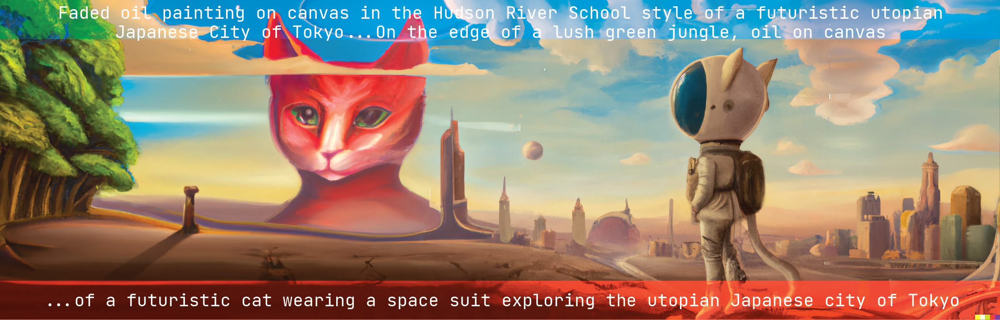

# Game 395 Unity3D and Software Development Weekly Things

This repository is an evolving repository that will contain documentation for the items we discuss during each week. The majority of the content in this repository will be [markdown](https://markdownguide.org) based content.

## Week 1-2

General Setup - please see the [Syllabus](https://github.com/JShull/GAME395_Unity/blob/main/Docs/Syllabus.md) and the [Schedule](https://github.com/JShull/GAME395_Unity/blob/main/Docs/Schedule.md) we got into setting up [GitHub profile README(s)](https://docs.github.com/en/account-and-profile/setting-up-and-managing-your-github-profile/customizing-your-profile/managing-your-profile-readme) and Unity accounts.

* [Video In Class 1-11-2023](https://youtu.be/z-M3p9AXb_k)
* [Video In Class 1-18-2023](https://youtu.be/9KX-0JFXWqk)

## Week 2-3

General Unity Editor 101 - please see the [Week2-3 Folder](./Week2_3/Week3_Spring2023.md) markdown document that covers that content and there will be a video recording made available on canvas at a later date.

* [Video In Class 1-23-2023](https://youtu.be/MEyLgRmJ5Fc)
* [Video In Class 1-25-2023](https://www.youtube.com/watch?v=9GAPnu-27xA)

## Week 3-4

Unity [Package Manager & Unity Input System](./Week4/Week4_InputSystem.md) and we spent 30 minutes going through an example simple project. 

* Working on a recap video of the entire week covering the content I showed on 2-1-2023
* I also am working on sharing that Unity project

## Week 5

Semester agreements/contracts and [GitHub Projects](https://docs.github.com/en/issues/planning-and-tracking-with-projects/creating-projects/creating-a-project)/[Kanban boards](https://en.wikipedia.org/wiki/Kanban_board).

* Documentation on working with [Scriptable Objects](./Week5/Spring2023_Kits_ScriptableObjects.md)
* Continue exploring content and [Custom Unity Packages](https://github.com/jshull/FP_Control)
  * [Unity Custom Packages Documentation](https://docs.unity3d.com/Manual/CustomPackages.html)

## Week 6

Continuation of last week with Scriptable Objects, some simple collisions/trigger scripting

* Monday:
  * In class time to work through GitHub projects and issue tracking
  * In class time to identify and write out first high stake assignment
* Wednesday: (REMOTE)
  * Briefly talk about [Unity UI old](https://learn.unity.com/tutorial/ui-components#5c7f8528edbc2a002053b4d1)
  * Most of our time: [Unity UI Toolkit/Builder new](https://learn.unity.com/tutorial/ui-toolkit-first-steps)
* What I owe you all:
  * Updated Video encompassing Prefabs, Scriptable Objects, Character Controllers, and simple Pick-ups/drops
  * Feedback for those who submit this week

## Week 7

Little bit of UI work from last week - inline style adjustments got me last week - & scene management, but mainly visual scripting and general scripting.

* John Notes:
  * UnityGameClass/Unity/B2G has scene loading/unloading and loading screen
  * GameKit/Unity/TwoDLite/ intro visual scripting - reimport 1.8 package if there are glitches on update from 2022.1 to 2022.2
  * Chunk of the class is going to be consumed on loading packages
* Monday:
  * Monday Scene Management and UnityEngine.SceneManager;
  * Introduction to Visual Scripting
    * [Avashly Repositories](https://github.com/avashly/unity-visualscripting-samples)
      * [3D Example: Release section SuperNova Unity Asset package](https://github.com/avashly/unity-visualscripting-samples/releases/download/Space_v1.0/UnityVisualScripting_SuperNova_Mar2021.unitypackage)
      * [2D Example: Release section Pixel Runner Asset package](https://github.com/avashly/unity-visualscripting-samples/releases/download/Runner_v1.0/UnityVisualScripting_EndlessRunner_Mar2021.unitypackage)
    * [Unity Clive the Cat](https://assetstore.unity.com/packages/templates/tutorials/unity-s-visual-scripting-tutorial-192201)
* Wednesday:
  * More Visual Scripting with previous examples and Clive the Cat
    * UI
    * Input
    * Events
    * ScriptableObjects
* What I owe still owe you all:
  * Entire Cleaned up Repository consisting of everything from Week 1-Week7
    * Character Controller
    * New UI Start Menu
      * Scene Management
        * Finish and upload FP_SceneManager.git Unity Package
    * Simple Visual Scripting examples
    * Simple C# Scripting examples
    * Scriptable object loader
    * Use of Prefabs/Variants
    * Clearing the Quad Game
  * Video tutorial: currently at 2 hours (editing it down)
